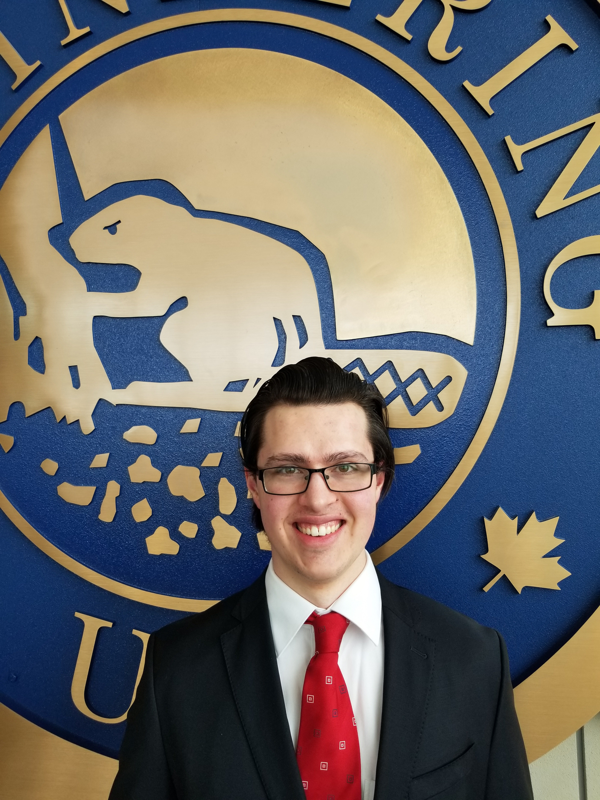

# Kieran Bererton

Hello there! Welcome to my portfolio project. Here you will find some information about me, as well as a look at some of my past projects and work experience.  

I graduated with a Bachelor's of Computer Engineering Co-op With Distinction from the University of Alberta in the Class of 2024. My main areas of interest are AI, Robotics, and Space. I am currently working as a Junior Software Developer at Subnet Solutions Inc.  
  
[Work Experience](wkexp.md)  
[AI](ai.md)   
[Robotics - Capstone](capstone.md)  
[Robotics - FRC](robotics.md)  
[Robotics - Mars Rover](spear.md)