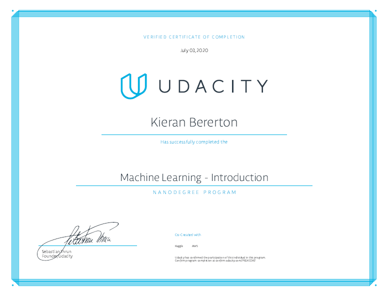

# Machine Learning and Artificial Intelligence

This sections documents some examples of my past work in the field of machine learning and artificial intelligence.

## CMPUT 466 - Machine Learning
This elective offered an introduction into the foundational mathematics that govern basic regression and classification models. Topics included:

* Linear Regression  
    * Mean Squared error
    * Gradient Descent
    * Closed-form solution
    * Maximum Likelihood Estimation
    * Maximum a Posteriori Inference
* Linear Classification 
    * Logistic Regression
    * Softmax Regression
    * Naive Bayes
* Neural Networks

The course included a "mini-project" in which we had to apply several machine learning models to a simple problem of our choosing. I chose to generate classification models for the Titanic passengers dataset, the code for and results of which can be seen in this [notebook](466project.html).

## University of Alberta Centre for Smart Transportation
See my [work experience](wkexp.md) page.

## Udacity - Machine Learning Nanodegree
To prevent myself from going insane while stuck in my house over the summer of 2020, I decided the best remedy for that would be to complete a crash course in machine learning. This course offered an introduction to supervised, unsupervised, and deep learning. Each section included small projects such as landmark classification and flower classification.

