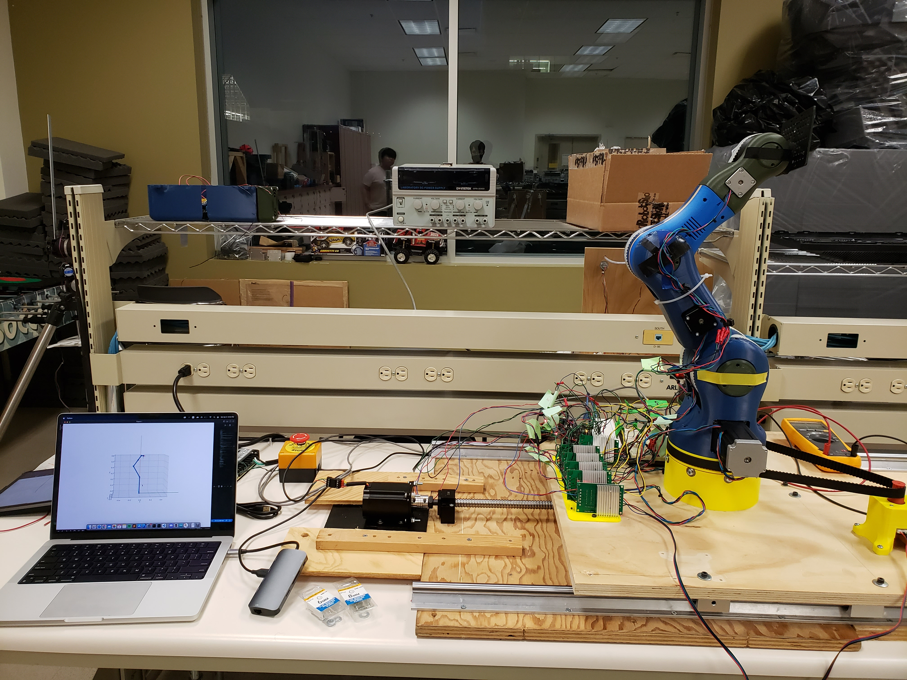

[home](README.md)  
[work experience](wkexp.md)  
[AI](ai.md)   
[robotics - FRC](robotics.md)

# Robot Arm Satellite Positioning Simulator (RASPS)

This was my computer engineering design capstone project. Myself and three other students were tasked with developing a "test bed system to support hardware-in-the-loop simulation and modelling of satellite proximity operations." 

## Project Objectives  
Our specific project objectives were outlined as follows:
1.	Ability to move in 5th motion axis for the robotic arm
2.	Support 3 Kg of weight at full extension
3.	Mimic the condition of space and has a smooth, continuous motion.
4.	Safely operate within specified minimum and maximum motion constraints.
5.	Joint sensors for improved arm tracking is a stretch goal.
6.	Master kill switch is incorporated to kill the active status.
7.	Mount robot arm to rail system to provide horizontal motion [at 25 mm/s]
8.	Develop customizable software that will control the arm.

In practice, this meant restoring an existing 3D-printed robot arm, mounting it to a rail system, and writing control software for the combined arm-rail system.

## The Arm

The robot arm was a 5 degree-of-freedom (DoF) 3D-printed arm based on an [open-source design](https://www.bcn3d.com/bcn3d-moveo-the-future-of-learning-robotic-arm/){:target="_blank"} and from a previous team's capstone project. The arm had been left to us in an unkown state, so our first task was to diassemble the arm, test each component, and add any missing pieces. The arm was missing a microcontroller, which had to be sourced, installed, and programmed. We also replaced the "claw" at the end of the arm with a mounting plate so that satellite models could be mounted to the arm during motion simulation tests. 

## The Rail

The rail system was our main addition to the system as it had to be designed and built from scratch. We decided on using a ball screw system, as it would best allow us to achieve our targeted rail motion precision. The rails were mounted to plywood for stability, and the arm was then mounted to the rails. 

## The Control System

The control system consisted of two main parts: the microcontroller and the control system. An arduino microcontroller using the AccelStepper and MultiStepper libraries controlled the stepper motors, and received commands from a laptop running our control software. Our software used an inverse kinematics library and a model of the robot to convert our input coordinates into the robot's motion. The link to the project's GitHub repository can be found [here](https://github.com/ECE492-RASPSP1/RASPSP1/){:target="_blank"}.

## The Result
Ultimately, we were able to complete the system and move in six DoF (5 on the arm + 1 on the rail) at the target speeds, though we were unable to hit our target weight. We also left the addition of joint sensors to a future team. The final arm, rail, and software system is shown here, and a short demo video is linked below.

[Short Demo Video](capstone_demo.MP4){:target="_blank"}