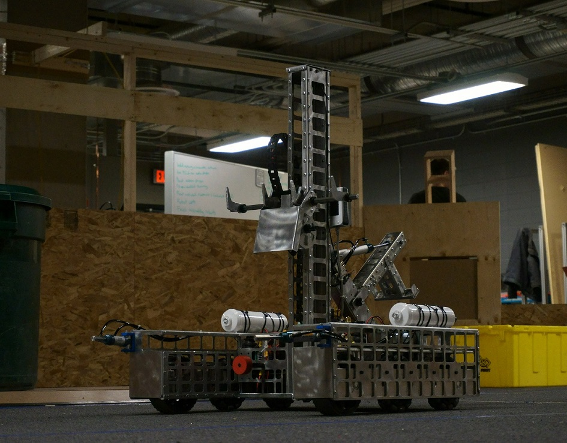

[home](README.md)  
[work experience](wkexp.md)  
[AI](ai.md)   
[robotics - capstone](capstone.md)  

# FIRST Robotics Competition (FRC)

The FIRST Robotics Competition 
([FRC](https://www.firstinspires.org/robotics/frc){:target="_blank"}) 
is an international high school robotics competition. Each year, a new game is revealed to teams, for which they must build an industrial-sized robot and compete in regional and international events. 

I was on Team 4334 Alberta Tech Alliance (ATA) for all three years of high school (2015-2017). 

## 2015
In 2015, I was a rookie programmer and scout. We won the Utah Regional and attended the World Championships in St.Louis.

## 2016
In 2016, I was part of the ATA-sponsored rookie team 6082 Calgary Tech Coalition (CTC). I was involved in most aspects of this robot, including design, manufacturing, assembly, wiring, and driving. We were the finalists at the Western Canada Regional and attended the World Championships in Houston.

## 2017
In 2017, I was again involved in many parts of the team, including game design, prototyping, assembly, wiring, and as a member of the drive team. We won the Western Canada Regional and attended the World Championships in Houston.
