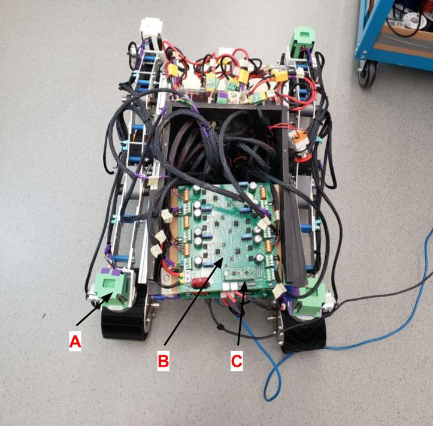
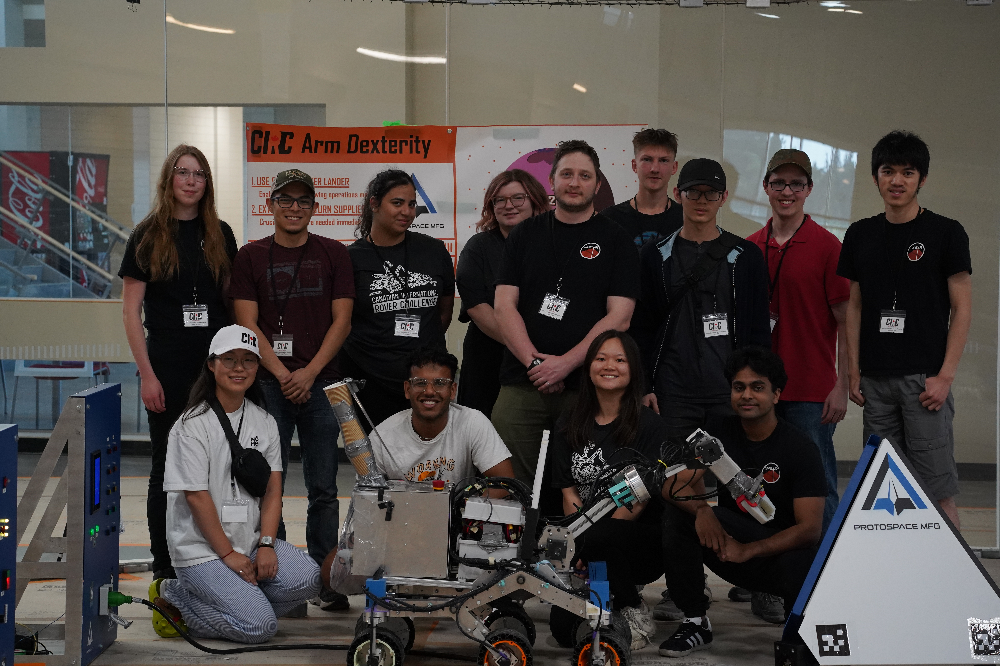
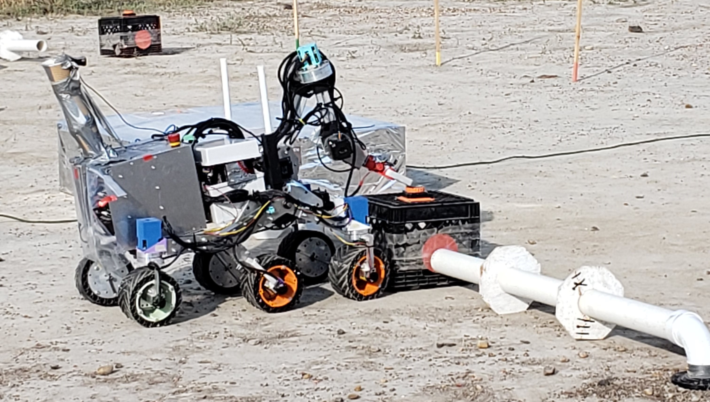

[Home](README.md)  
[Work Experience](wkexp.md)  
[AI](ai.md)   
[Robotics - Capstone](capstone.md)  
[Robotics - FRC](robotics.md)

# Space Exploration Alberta Robotics (SPEAR)

[SPEAR](https://spaceualberta.ca/) is a student club at the University of Alberta whose goal is to build a Mars-style rover to compete in the University Rover Challenge ([URC](https://urc.marssociety.org/home)) and the Canadian International Rover Challenge ([CIRC](https://circ.cstag.ca/2024/)). I was a member of the team for the 2024 competition season. 

Though I was initially part of the software team, developing the rover control software using ROS2 in a Linux environment, the majority of my time was spent working on the rover's electrical system. This included both hardware and firmware components. For hardware, I soldered wires to encoder sensor boards (housed in A) based on the desired signal lines, and worked on the wire management system for the sensors and motors. The electrical components were controlled from custom motor controller boards containing TMC-5160 stepper motor controllers (B) and an STM-32 microcontroller (C) for interfacing with the rover control software. I also worked on enhancing the firmware to include a function that would automatically detect and correct discrepancies between the steering motors' expected position and their actual position. This allowed the rover to drive much more smoothly and prevented unnecessary strain on the drivetrain. 

## CIRC 2024
In August 2024, I attended CIRC 2024 with my team. Over the course of the weekend, we were given a series of tasks to attempt, each of which had to be completed within a certain amount of time.  

One such task was called the Precision Infrastructure and Payload Extraction (PIPE) task, pictured below. In this scenario, we were given 60 minutes to shut off and remove a damaged fuel line and identify the damaged pipes. We then had 60 more minutes to replace the fuel line with a new set of pipes. Here, our rover is turning a dial to turn off the "fuel pump". 

Overall, though we encountered many obstacles, we were still able to place 13th overall, and placed as high as 6th in an individual task (the PIPE task shown above).