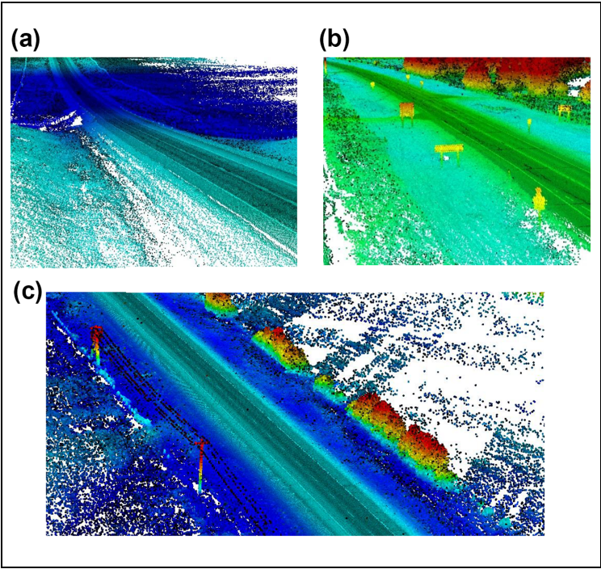

# Work Experience
This section documents my co-op work experience.

## Software Developer Intern - Subnet Solutions Inc.

(About subnet)  

I worked at Subnet for two non-consecutive stints: 
* for my last two official work terms (June 2022-December 2022)
* the following summer (May-August 2023)

At Subnet, I worked...

## Research Assistant - University of Alberta Centre for Smart Transportation (January-August 2021)

For my first two work terms I was a research assistant at the Centre for Smart Transportation (CST). Their focus is researching issues in transportation safety, planning, and operations. My team's focus was on using machine learning models to detect road signs in point cloud scans of roadways. I worked remotely with my supervisor and another student on multiple aspects of the research process:

* Paper Review: Papers that had previously been submitted to papers were returned to us with reviewers' comments. We then had to address each comment specifically, often by updating parts of the paper.
* Literature Review: The papers we worked on included large literature review sections. We had to locate and acquire the latest research related to our technology, read it, and summarize it so that it could be included in our paper.
* Point Cloud Analysis: We used machine learning to detect traffic signs in LiDAR scans of roadways.  
[Here is a link to the abstract of one of the papers I worked on](https://doi.org/10.1080/15472450.2022.2074792)

Example point cloud data ([source](https://journals.sagepub.com/doi/pdf/10.1177/03611981211029934)):
